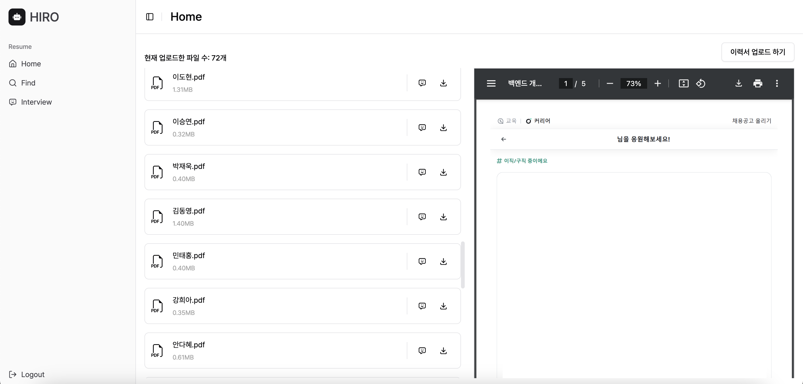
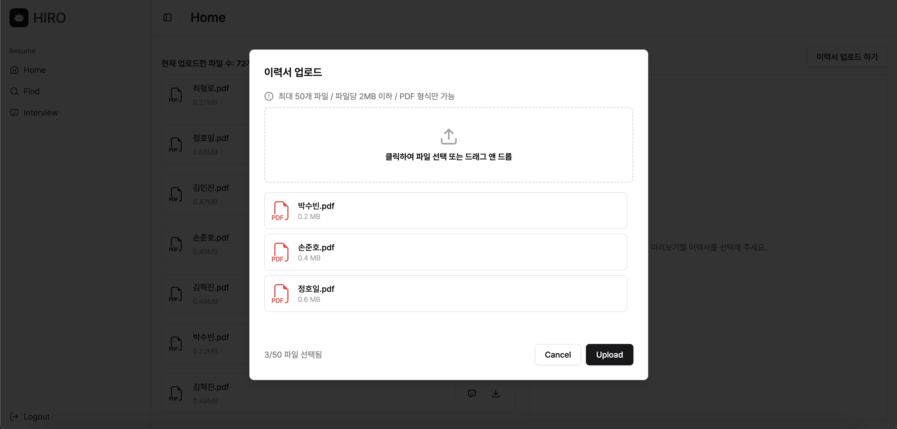
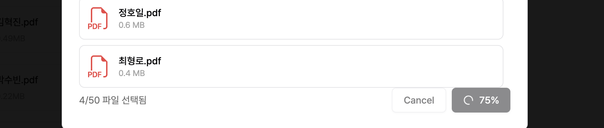
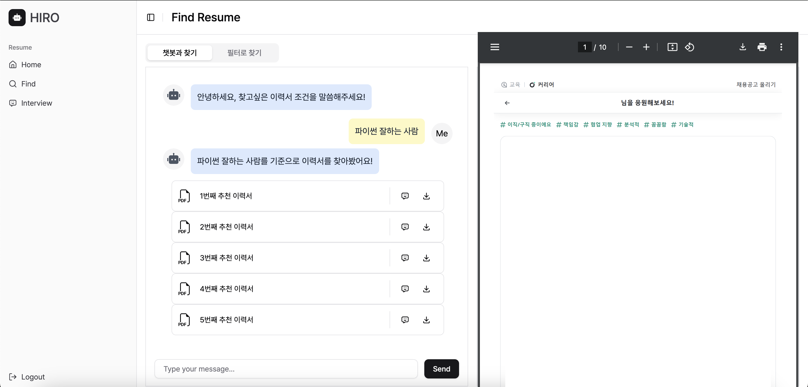
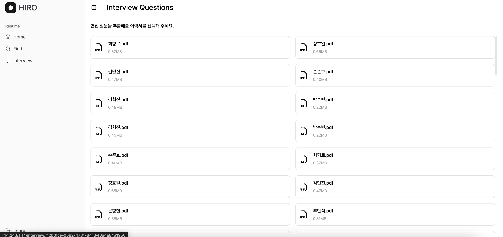
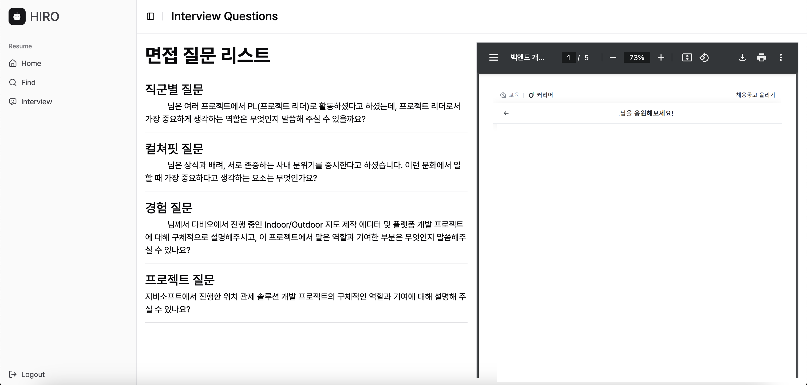

## Getting Started

```
yarn install
yarn dev
```

## 🛠 기술 스택

- **Language:** TypeScript
- **Library:** Next.js 15
- **CSS:** Tailwind CSS + Shadcn/ui
- **State Management:** TanStack Query / Zustand
- **HTTP Client:** Rest API, Axios
- **Package Manager:** Yarn
- **Linting:** ESLint, Prettier

## 📸 화면 구성

### 1. 홈

#### 1) 홈



- 업로드한 이력서 미리보기 및 다운로드

#### 2) 파일 업로드 하기





- 파일 일괄 업로드, 업로드 시 버튼에 진행률 표시

### 2. 이력서 찾기

#### 1) 챗봇과 함께 이력서 찾기



#### 2) 필터로 이력서 찾기


### 3. 면접 질문 추천

#### 1) 이력서 선택하기



#### 2) 추천 면접 질문 보기


